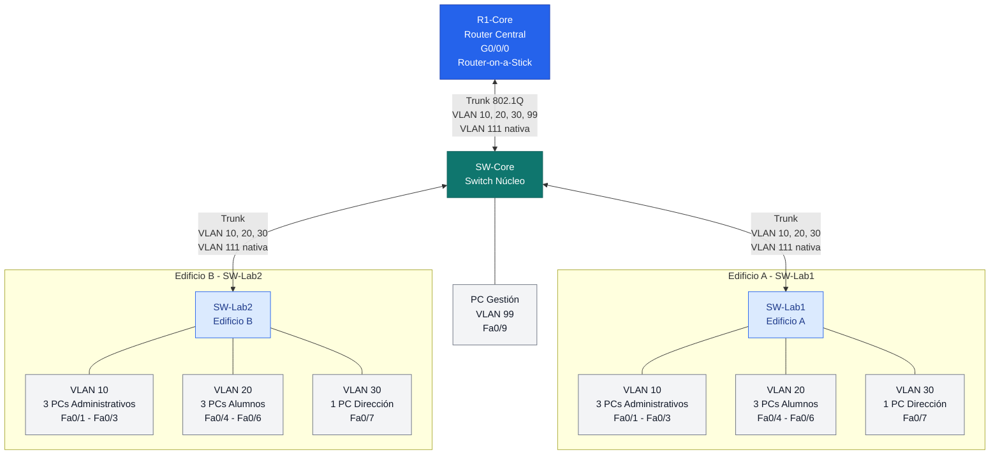

# Topología de Red: Router-on-a-Stick con VLANs

## 1. Diagrama de la topología

```text
                 [ R1-Core (Router) ]
                          |
                          | G0/0/0
                          | Trunk 802.1Q
                          | Router-on-a-Stick
                          | VLANs 10, 20, 30, 99
                          | VLAN 111 nativa
                          |
                     [ SW-Core ]
                       /       \
              (Trunk) /         \ (Trunk)
          VLAN 111 nativa     VLAN 111 nativa
                    /             \
             [ SW-Lab1 ]       [ SW-Lab2 ]
             Edificio A        Edificio B

     Dispositivos en SW-Lab1:       Dispositivos en SW-Lab2:

     ├── VLAN 10: 3 PCs Admin       ├── VLAN 10: 3 PCs Admin
     │   Fa0/1 - Fa0/3              │   Fa0/1 - Fa0/3
     │                              │
     ├── VLAN 20: 3 PCs Alumnos     ├── VLAN 20: 3 PCs Alumnos
     │   Fa0/4 - Fa0/6              │   Fa0/4 - Fa0/6
     │                              │
     └── VLAN 30: 1 PC Dirección   └── VLAN 30: 1 PC Dirección
         Fa0/7                          Fa0/7


     Conexión local de SW-Core:

     └── VLAN 99: 1 PC Gestión
         Puerto Fa0/9
```

## 2. Diagrama gráfico con Mermaid



## 3. Tabla de VLANs

| VLAN | Nombre | Función | Ubicación |
|---|---|---|---|
| 10 | Administrativos | Equipos administrativos | SW-Lab1 y SW-Lab2 |
| 20 | Alumnos | Equipos de alumnos | SW-Lab1 y SW-Lab2 |
| 30 | Dirección | Equipo de dirección | SW-Lab1 y SW-Lab2 |
| 99 | Gestión | PC de gestión | SW-Core, Fa0/9 |
| 111 | VLAN nativa | Tráfico sin etiquetar en los trunks | Enlaces troncales |

## 4. Configuración lógica

- **R1-Core:** realiza el enrutamiento entre las VLANs mediante subinterfaces en G0/0/0.
- **SW-Core:** conecta el router, SW-Lab1, SW-Lab2 y la PC de gestión.
- **SW-Lab1:** distribuye las VLANs a los dispositivos del edificio A.
- **SW-Lab2:** distribuye las VLANs a los dispositivos del edificio B.
- **VLAN 111:** se configura como VLAN nativa en ambos extremos de cada enlace troncal.
- **VLAN 99:** se utiliza para la gestión de la red.

## 5. Consideraciones importantes

1. Crear las VLANs necesarias en los switches.
2. Configurar los enlaces troncales con la VLAN nativa 111 en ambos extremos.
3. Configurar las subinterfaces del router con `encapsulation dot1Q`.
4. Configurar la subinterfaz de la VLAN 111 con `encapsulation dot1Q 111 native` si el router también utilizará esa VLAN para enrutamiento.
5. Asignar las direcciones IP de gateway y las direcciones de los dispositivos.
6. Configurar el puerto Fa0/9 de SW-Core como acceso a la VLAN 99.

**Nota:** La VLAN nativa 111 y la VLAN 99 de gestión cumplen funciones distintas. La VLAN 111 transporta tráfico sin etiquetar en los trunks, mientras que la VLAN 99 se utiliza para la red de gestión.****


# 🛠️ GUÍA TÉCNICA DE CONFIGURACIÓN DE REDES: VLANs Y INTER-VLAN


Este documento contiene la sintaxis exacta de Cisco IOS para configurar una red segmentada con tres VLANs y enrutamiento a través de un esquema **Router-on-a-Stick**.

---

## 📊 1. Resumen del Direccionamiento IP y Segmentación

A continuación se detallan las subredes y las funciones asignadas a cada una de las redes virtuales:

* **VLAN 10:** Datos de usuarios en la red local. (`LAN10`)
* **VLAN 20:** Datos de usuarios secundarios. (`LAN20`)
* **VLAN 99:** Red de administración interna. (`Management`)

### 📌 Tabla de Asignación de Interfaces y Puertas de Enlace

| Elemento de Red | ID / Interfaz | Dirección IP | Máscara de Subred | Función Principal |
| :--- | :--- | :--- | :--- | :--- |
| **VLAN 10** | Subinterfaz Gi0/0.10 | 192.168.10.1 | 255.255.255.0 | Gateway LAN 10 |
| **VLAN 20** | Subinterfaz Gi0/0.20 | 192.168.20.1 | 255.255.255.0 | Gateway LAN 20 |
| **VLAN 99** | Subinterfaz Gi0/0.99 | 192.168.99.1 | 255.255.255.0 | Gateway Administración |
| **Switch SVI** | Interfaz Virtual VLAN 99 | 192.168.99.2 | 255.255.255.0 | IP de Gestión Remota |

---

## 🎛️ 2. Configuración General en el Switch

> ⚠️ **Importante:** Asegúrate de ejecutar el comando `enable` y `configure terminal` antes de ingresar las siguientes instrucciones en la consola.

### 🔹 Bloque A: Creación y nombramiento de VLANs
```ios
vlan 10
 name LAN10
 exit

vlan 20
 name LAN20
 exit

vlan 99
 name Management
 exit
```

### 🔹 Bloque B: Asignación de IP de Gestión y Puerta de Enlace (SVI)
```ios
interface vlan 99
 ip add 192.168.99.2 255.255.255.0
 no shut
 exit

ip default-gateway 192.168.99.1
```

### 🔹 Bloque C: Modos de Puertos (Acceso y Troncales)
```ios
interface fa0/6
 switchport mode access
 switchport access vlan 10
 no shut
 exit

interface fa0/1
 switchport mode trunk
 no shut
 exit

interface fa0/5
 switchport mode trunk
 no shut
 end
```

---

## 🔀 3. Configuración del Enrutamiento en el Router (Router-on-a-Stick)

Para habilitar la comunicación entre diferentes VLANs, dividimos la interfaz física `gigabitEthernet0/0` en subinterfaces lógicas y aplicamos la encapsulación `dot1Q`.

```ios
enable
configure terminal

interface gigabitEthernet0/0
 no shutdown
 exit

interface gigabitEthernet0/0.10
 encapsulation dot1Q 10
 ip address 192.168.10.1 255.255.255.0
 exit

interface gigabitEthernet0/0.20
 encapsulation dot1Q 20
 ip address 192.168.20.1 255.255.255.0
 exit

interface gigabitEthernet0/0.99
 encapsulation dot1Q 99
 ip address 192.168.99.1 255.255.255.0
 exit

end
```

---

## 💾 4. Almacenamiento en Memoria No Volátil

Una vez verificada la topología, debes guardar los cambios en la **NVRAM** para prevenir pérdidas tras un reinicio físico del hardware:

```ios
write memory
```

---

## 📋 5. Tareas Pendientes para el Administrador de Red

- [ ] Verificar la tabla de VLANs con el comando `show vlan brief`.
- [ ] Validar el estado de los enlaces troncales usando `show interfaces trunk`.
- [ ] Hacer pruebas de conectividad (*ping*) desde un equipo de la VLAN 10 hacia la VLAN 20.
